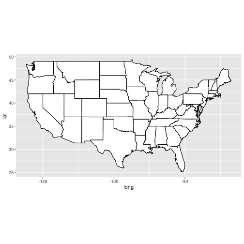
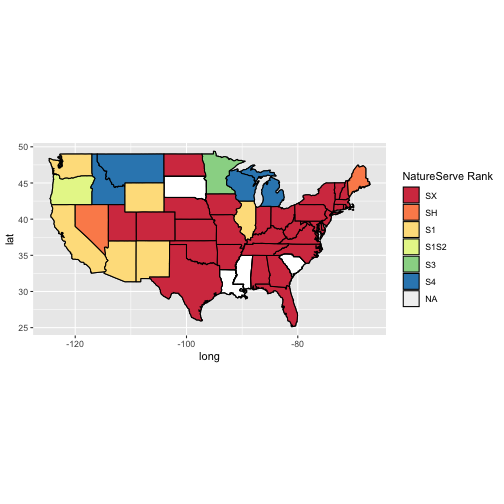

`natserv` is an R package that interacts with the API services of the non-profit organization NatureServe (https://services.natureserve.org/). If you want to read the full API documentation, you can find it at https://explorer.natureserve.org/api-docs/

See also the taxize book (https://taxize.dev/) for 
a manual on working with taxonomic data in R, including with NatureServe data.

This tutorial will walk you through installing `natserv` and using its handy functions. To help show you what `natserv` can do, this will also teach you how to:

* Find a species' unique identifier used by NatureServe 
* Use that identifier to pull data from NatureServe's API
* Search NatureServe for multiple species
* Create a dataframe of the conservation status of an example species, the gray wolf (*Canis lupus*)
* And, just for fun, we're going to make a map of the gray wolf's status in each state of the US with `ggplot`


## A quick introduction to NatureServe

NatureServe is a non-profit organization that provides biodiversity data freely online. 
They maintain a database comprised of data from natural heritage programs and conservation data centers - this database includes information about the conservation status, taxonomy, geographic distribution, and life history information for over 70,000 species of plants, animals, and fungi in Canada and the United States.
You can find information about their data coverage (https://explorer.natureserve.org/AboutTheData/DataCoverage), and data sources (https://explorer.natureserve.org/AboutTheData/Sources) on their website. NatureServe also hosts data on ecological communities/systems and their conservation status.  

While small amounts of data can be easily collected using their online NatureServe explorer site (http://explorer.natureserve.org/), downloading species data this way would be incredibly slow. 
Thus `natserv` was born. 
This R package can access NatureServe's online API for rapid downloading of conservation data, allows for easy access to multiple species' data sets, and  loads the data directly into your R session. 

## Installing `natserv` from CRAN or GitHub

Stable version:


```r
install.packages("natserv")
```

Development version:


```r
remotes::install_github("ropensci/natserv")
```

After successful installation, load the package into the environment:


```r
library(natserv)
```

## Obtaining a NatureServe API key

Before starting to use the NatureServe API, you need to have an API key.
NatureServe uses this key to track and prevent any malicious usage and the `natserv` package needs it in order to access their database.

Fortunately, API keys are available for free to users who register with NatureServe as Developers.
To register and obtain an API key: https://explorer.natureserve.org/api-docs/

After registering, NatureServe will send you an email at the registered address that contains an Access Key ID.

###  Linking R to your API key

There are two ways to do this - the one that works best for you likely depends on how often you plan on using `natserv`. 

#### 1. Define the API key just for this R session

The quick way is to load the API key directly in the R session:


```r
options(NatureServeKey = "YOUR-ACCESS-KEY-ID")
```
Every time you start a new R session and want to use `natserv`, you'll have to run this line.


#### 2. Define the API key for all scripts in your project

If you don't want to run `options(NatureServeKey = "YOUR-ACCESS-KEY-ID")` every time you use `natserv`, you can modify the `.Rprofile` or `.Renviron` files to link the API key for all R scripts in your Rproject.
When R starts up, it reads the `.Rprofile` and `.Renviron` and runs any commands in these files as it launches. 

To set the API key for all scripts in the project, open your project-specific files with `file.edit(".Rprofile")` or `file.edit(".Renviron")`, then add this line:

```
options(NatureServeKey = "YOUR-ACCESS-KEY-ID")
```

After saving this file, every time you open an R session in that project your API key is automatically loaded into the session. 

## `natserv` functions

Now that R knows our NatureServe API key, we can use `natserv` to access their database.
All of `natserv`'s functions are prefixed with `ns_` to avoid confusion with other packages - here are the functions provided by `natserv`:

1. `ns_search` - a function to look up the ID code for the species you are querying
2. `ns_data` - a function that uses the ID code from `ns_search` to pull data off of NatureServe and into your R session
3. `ns_images` - a function that searches for metadata for the images hosted by NatureServe, including the URLs where the images can be found

### `ns_search` - finding the UID
NatureServe uses a unique ID (UID) for each species in their database. 
The `ns_data` function requires you to supply the UID for the species you are looking to download data for, and unless you already know the species' UID you will need to use `ns_search` to find it. 

Here's how to use a species' binomial name to find its UID, using the gray wolf (*Canis lupus*) as an example:


```r
gray.wolf.search <- ns_search(x="Canis lupus")
gray.wolf.search
#> # A tibble: 1 x 5
#>   globalSpeciesUid jurisdictionSci… commonName taxonomicCommen… natureServeExpl…
#>   <chr>            <chr>            <chr>      <chr>            <chr>           
#> 1 ELEMENT_GLOBAL.… Canis lupus      Gray Wolf  Based on recent… http://explorer…
```
After a moment of searching, `ns_search` returns a tibble containing the UID, common name, scientific name, taxonomic comments, and the URI for the entry in the NatureServe database.


```r
gray.wolf.search$globalSpeciesUid
#> [1] "ELEMENT_GLOBAL.2.105212"
```

The UID for *Canis lupus* is `ELEMENT_GLOBAL.2.105212`, and this ID can be used to access the NatureServe database through their API. 

#### A quick aside: Searching for multiple species

**Searching for all species within a genus**

If we are interested in multiple species (all members of the genus *Canis* for example), we can use `*` as a wild card to pull out all available UIDs for a genus:


```r
canis.search <- ns_search(x="Canis *")
```

This returns a tibble with 14 rows, one for each entry in *Canis*: 


```
#> # A tibble: 14 x 5
#>    globalSpeciesUid jurisdictionSci… commonName taxonomicCommen…
#>    <chr>            <chr>            <chr>      <chr>           
#>  1 ELEMENT_GLOBAL.… Canis latrans    Coyote     Recent genetic …
#>  2 ELEMENT_GLOBAL.… Canis rufus      Red Wolf   Based on recent…
#>  3 ELEMENT_GLOBAL.… Canis lupus      Gray Wolf  Based on recent…
#>  4 ELEMENT_GLOBAL.… Canis lupus bai… Mexican W… <NA>            
#>  5 ELEMENT_GLOBAL.… Canis lupus lig… Alexander… Molecular studi…
#>  6 ELEMENT_GLOBAL.… Canis lupus occ… Northern … <NA>            
#>  7 ELEMENT_GLOBAL.… Canis lupus nub… Southern … <NA>            
#>  8 ELEMENT_GLOBAL.… Canis lupus lyc… Eastern W… See taxonomy co…
#>  9 ELEMENT_GLOBAL.… Canis lupus arc… Arctic Gr… <NA>            
#> 10 ELEMENT_GLOBAL.… Canis sp. cf. l… Eastern W… New genetic ana…
#> 11 ELEMENT_GLOBAL.… Canis rufus      Red Wolf   Based on recent…
#> 12 ELEMENT_GLOBAL.… Canis lupus bai… Mexican W… <NA>            
#> 13 ELEMENT_GLOBAL.… Canis rufus      Red Wolf   Based on recent…
#> 14 ELEMENT_GLOBAL.… Canis lupus lyc… Eastern W… See taxonomy co…
#> # … with 1 more variable: natureServeExplorerURI <chr>
```

**Searching for multiple species if the wildcard won't do**

If the species you want data about aren't members of the same genus, the wild card method won't work. 
Instead, to search for multiple taxa you can make a vector of search terms containing the scientific names of each species you're interested in, then search each one in a loop or with the `lapply` function:


```r
species.search.list <- c('Canis lupus', 'Lynx rufus', 'Puma concolor')
multispecies.search <- lapply(species.search.list, FUN = ns_search)
```

This returns a 3-element list, where each list item is the tribble returned by `ns_search`:


```
#> [[1]]
#> # A tibble: 1 x 5
#>   globalSpeciesUid jurisdictionSci… commonName taxonomicCommen… natureServeExpl…
#>   <chr>            <chr>            <chr>      <chr>            <chr>           
#> 1 ELEMENT_GLOBAL.… Canis lupus      Gray Wolf  Based on recent… http://explorer…
#> 
#> [[2]]
#> # A tibble: 1 x 5
#>   globalSpeciesUid jurisdictionSci… commonName taxonomicCommen… natureServeExpl…
#>   <chr>            <chr>            <chr>      <chr>            <chr>           
#> 1 ELEMENT_GLOBAL.… Lynx rufus       Bobcat     Placed in genus… http://explorer…
#> 
#> [[3]]
#> # A tibble: 1 x 5
#>   globalSpeciesUid jurisdictionSci… commonName taxonomicCommen… natureServeExpl…
#>   <chr>            <chr>            <chr>      <chr>            <chr>           
#> 1 ELEMENT_GLOBAL.… Puma concolor    Cougar     Formerly includ… http://explorer…
```

### `ns_data` - searching for records with the UID

Now that we have our species' UID, we can search NatureServe's API for more data about that species' conservation status, taxonomy, and other information. 

Sticking to the gray wolf example, let's pull up what data are available for *Canis lupus* using the UID from `ns_search`:


```r
gray.wolf.data <- ns_data(gray.wolf.search$globalSpeciesUid)
```

#### Data returned by `ns_data`

The `ns_data` command returns NatureServe data as a list of lists. 
The outer 'list' has a length of 1 and is named after the species' UID. Within this top-level list are more nested sublists with the following information (*note: this is not exhaustive; more data are available if you dig through the list structure*):

* `natureserve_uri` - the URI for the species' web page
* `classification` - a list containing taxonomic information for the species
  * `classification$names` - scientific name(s) -  either formatted (i.e. italicized) or not - with information about the author of the nomenclature, concept reference information, and classification status
  * `classification$natureServePrimaryGlobalCommonName` - the common name for the species used by NatureServe
  * `classification$otherGlobalCommonNames` - other common names with the language of that common name provided by `attr(,"language")
  * `classification$taxonomy` - information regarding kingdom, phylum, class, genus, and comments on the taxonomic classification of the species; both formal and informal taxonomies are provided
* `economicAttributes` - the economic impacts of the species and how it impacts human activities
* `license` - information about NatureServe's data usage license
* `references` - a list of scientific references that collected the reported data
* `conservationStatus` - a list containing conservation status information from a variety of geographic locations
  * `conservationStatus$other$USESA Status` - US Endangered Species Act status
  * `conservationStatus$other$COSEWIC Status` - Committee on the Status of Endangered Wildlife in Canada status
  * `conservationStatus$other$IUCN Status` - International Union for the Conservation of Nature status
  * `conservationStatus$other$CITES Protection Status` - Convention on International Trade of Endangered Species status
  * `conservationStatus$natureserve` - a list of species ranks as designated by NatureServe, as well as descriptions, rationale, population estimates, current threats, comments, and information on when the status was last reviewed. This list also contains state- and province-wide status for the species where it is found
* `managementSummary` - a list containing subslists `$restorationPotential` (a description of whether restoration is feasible for the species) and `$managementRequirements` (factors which are necessary to promote restoration of the species)
* `distribution` - information on the species' distribution globally and within Canada and the United States
  * `distribution$conservationStatusMap` - a URI to an online conservation status map hosted on NatureServe
  * `distribution$globalRange`- information on the total area inhabited by the species, as well as a description of this global distribution and how it may have changed over time
  * `distribution$rangeMap` - a URI to an online range map hosted on NatureServe
  * `distribution$endemism` - a description of the species' endemism
  * `distribution$nations` - a list of where the species can be found during what times of year (i.e. year-round, regularly occurring, etc.) as well as information on sub-national scales like state and provincial presence of the species
  * `distribution$watersheds` - a tibble of watersheds where the species has been found and when
  * `distribution$countyDistribution` - a tibble containing county-wide information about where and when the species has been observed in the United States
  
Fortunately, even though the list structure is rather complex, you can view the entire list hierarchy with `str()`, short for `structure`:


```r
str(gray.wolf.data)
```
```
## List of 1
##  $ ELEMENT_GLOBAL.2.105212:List of 11
##   ..$ uid                  : chr "ELEMENT_GLOBAL.2.105212"
##   ..$ speciesCode          : chr "AMAJA01030"
##   ..$ natureserve_uri      : chr "http://explorer.natureserve.org/servlet/NatureServe?searchName=Canis+lupus"
##   ..$ classification       :List of 2
##   .. ..$ names   :List of 3
##   .. .. ..$ scientificName                    :List of 4
##   .. .. .. ..$ unformattedName    :List of 1
##   .. .. .. .. ..$ : chr "Canis lupus"
##   .. .. .. ..$ formattedName      :List of 1
##   .. .. .. .. ..$ : chr "<i>Canis lupus</i>"
##   .. .. .. ..$ nomenclaturalAuthor:List of 1
##   .. .. .. .. ..$ : chr "Linnaeus, 1758"
##   .. .. .. ..$ conceptReference   :List of 3
##   .. .. .. .. ..$ formattedFullCitation     :List of 1
##   .. .. .. .. .. ..$ : chr "Wilson, D. E., and D. M. Reeder (editors). 1993. Mammal species of the world: a taxonomic and geographic refere"| __truncated__
##   .. .. .. .. ..$ nameUsedInConceptReference:List of 2
##   .. .. .. .. .. ..$ unformattedName:List of 1
##   .. .. .. .. .. .. ..$ : chr "Canis lupus"
##   .. .. .. .. .. ..$ formattedName  :List of 1
##   .. .. .. .. .. .. ..$ : chr "<i>Canis lupus</i>"
##   .. .. .. .. ..$ classificationStatus      :List of 1
##   .. .. .. .. .. ..$ : chr "Standard"
##   .. .. .. .. ..- attr(*, "code")= chr "B93WIL01NAUS"
##   .. .. ..$ natureServePrimaryGlobalCommonName:List of 1
##   .. .. .. ..$ : chr "Gray Wolf"
##   .. .. ..$ otherGlobalCommonNames            :List of 4
##   .. .. .. ..$ commonName:List of 1
##   .. .. .. .. ..$ : chr "Grey Wolf"
##   .. .. .. .. ..- attr(*, "language")= chr "EN"
##   .. .. .. ..$ commonName:List of 1
##   .. .. .. .. ..$ : chr "Lobo Gris"
##   .. .. .. .. ..- attr(*, "language")= chr "ES"
##   .. .. .. ..$ commonName:List of 1
##   .. .. .. .. ..$ : chr "Wolf"
##   .. .. .. .. ..- attr(*, "language")= chr "EN"
##   .. .. .. ..$ commonName:List of 1
##   .. .. .. .. ..$ : chr "loup gris"
##   .. .. .. .. ..- attr(*, "language")= chr "FR"
##   .. ..$ taxonomy:List of 2
##   .. .. ..$ formalTaxonomy  :List of 8
##   .. .. .. ..$ kingdom          :List of 1
##   .. .. .. .. ..$ : chr "Animalia"
##   .. .. .. ..$ phylum           :List of 1
##   .. .. .. .. ..$ : chr "Craniata"

... truncated to save space
```

To pull out a specific piece or type of information, it is necessary to dig through the lists of lists to get at what you want. 
For example, if I would like to know which Phylum the gray wolf belongs to, I first go into the top-level `ELEMENT_GLOBAL.2.105212` list, then into the `classification` list, then the `taxonomy` list, then `formalTaxonomy`, then `phylum` within  using `$` notation:


```r
gray.wolf.phylum <- gray.wolf.data$ELEMENT_GLOBAL.2.105212$classification$taxonomy$formalTaxonomy$phylum
gray.wolf.phylum
#> [[1]]
#> [1] "Craniata"
```

### `ns_images` - searching NatureServe's image repository

Unlike `ns_data`, the `ns_images` function can search for images of your species of interest using either the scientific name, UID, or common name of the species. 
`ns_images` can take one of three types of search information: `uid`, the UID of the species (returned by `ns_search`),  `scientificName`, or `commonName`: 


```r
# Search with the UID (ELEMENT_GLOBAL.2.105212)
gray.wolf.imageInfo <- ns_images(uid = 'ELEMENT_GLOBAL.2.105212')

# Or search using the scientific name:
gray.wolf.imageInfo <- ns_images(scientificName = 'Canis lupus')

# Or search using the common name:
gray.wolf.imageInfo <- ns_images(commonName = 'Gray wolf')
```

This returns metadata for images of the gray wolf hosted by NatureServe, including the creator, the publisher, the description, and usage rights. When no other arguments are given, `ns_images` returns metadata for all available images in their database. Later in the vignette, we'll look at how to return specific image resolutions according to your needs.

When we provide `ns_images` with only `scientificName` or `commonName` search names, it will only search for those terms in NatureServe's Primary Names field. 
But you can also search using synonymous common and scientific names for the species.
By including `includesSynonyms = 'Y'` in the `ns_images` command, the provided search term will be looked for in the Primary names of each species, as well as the synonymous Scientific and Common Names fields.
Of course, if you search using the UID (i.e. with `uid`), there are no synonyms. 

In the future it may also be possible to search using ITIS names using the `ITISNames` argument, but as of August 2018 searching with ITIS names is not possible.

An additional argument, `resolution`, can be used to indicate the desired resolution for the image. 
If `resolution` is not specified, `ns_images` returns metadata for all available image resolutions. 

To only return metadata for a certain `resolution`, you can supply one of the following values to the `resolution` argument:

* `resolution = 'lowest'` 
* `resolution = 'highest'` 
* `resolution = 'thumbnail'`
* `resolution = 'web'` (return metadata for the image used on NatureServe's web page for the species)

## Tutorial: Using `natserv` data to map wolf conservation status across the US

Now, using NatureServe data, let's see an example of what we can do with it. 
As an example to familiarize yourself with `natserv`, let's build a map of conservation status of the gray wolf in each state of the United States. 
We'll need to load a few libraries first (if you don't have them loaded already):


```r
library(natserv)
library(ggplot2)
library(dplyr)
```

Next, let's combine the `ns_search` and `ns_data` functions to pull out state-level conservation status for the gray wolf from NatureServe's API:


```r
gray.wolf.alldata <- ns_data(ns_search('Canis lupus')$globalSpeciesUid)

# Now let's just pull out the sub-national conservation data
wolf.conservation.status <- gray.wolf.alldata$ELEMENT_GLOBAL.2.105212$conservationStatus$natureserve$nationalStatuses$US$subnationalStatuses

# This returns a list of lists containing the conservation status in each state
wolf.conservation.status[[1]]
#> $subnationName
#> [1] "Alabama"
#> 
#> $subnationCode
#> [1] "AL"
#> 
#> $rank
#> [1] "SX"
#> 
#> $roundedRank
#> [1] "SX"
```

```r
# The outer list contains one entry for each state
# Let's convert it into a data.frame for mapping
wolf.conservation.df <- as.data.frame(matrix(unlist(wolf.conservation.status), nrow=length(wolf.conservation.status), byrow=T))
colnames(wolf.conservation.df) <- c('region','abbreviation','NatServ.Rank','NatServe.Rounded.Rank')

head(wolf.conservation.df)
#>       region abbreviation NatServ.Rank NatServe.Rounded.Rank
#> 1    Alabama           AL           SX                    SX
#> 2     Alaska           AK           S4                    S4
#> 3    Arizona           AZ           S1                    S1
#> 4   Arkansas           AR           SX                    SX
#> 5 California           CA           S1                    S1
#> 6   Colorado           CO           SX                    SX
```

NatureServe defines conservation status at the sub-national level (indicated with an `S` prefix - `N` indicates national-level status). Sub-national status is defined below (from the NatureServe website (https://explorer.natureserve.org/AboutTheData/Statuses)):


The other status definitions aren't included in the gray wolf dataset, and aren't described here. 


```r
unique(wolf.conservation.df$NatServ.Rank)
#> [1] SX   S4   S1   SH   S3   S1S2
#> Levels: S1 S1S2 S3 S4 SH SX

# Check the order of levels in the NatServ.Rank factor column:
levels(wolf.conservation.df$NatServ.Rank)
#> [1] "S1"   "S1S2" "S3"   "S4"   "SH"   "SX"
```
At the moment, the levels of `NatServ.Rank` and `NatServe.Rounded.Rank` aren't ordered intuitively. 
Let's reorder them from most to least conservation concern. 

```r
wolf.conservation.df$NatServ.Rank <- factor(wolf.conservation.df$NatServ.Rank, 
levels(wolf.conservation.df$NatServ.Rank)[c(6,5,1,2,3,4)])

levels(wolf.conservation.df$NatServ.Rank)
#> [1] "SX"   "SH"   "S1"   "S1S2" "S3"   "S4"
```

Much better! Now let's use our data set to make a map. 


```r
# Using the ggplot2 library, we can automatically load map data for the US
states <- map_data('state')

# Let's first plot the empty map:
ggplot(data = states) + 
  geom_polygon(aes(x = long, y = lat, group = group), color = "black", fill="white") + 
  coord_fixed(1.3) +
  guides(fill=FALSE)  # this removes the legend from the map 
```



We now have to merge the two data sets - the `states` dataframe from `ggplot` and the NatureServe conservation status data. 
To do this, we can use the `inner_join` function from the `dplyr` package


```r
# Change wolf.conservation.df region to character, and coerce it to lowercase so that it matches the region name in the states dataframe
wolf.conservation.df$region <- tolower(as.character(wolf.conservation.df$region))
wolf.conservation.join <- full_join(states, wolf.conservation.df, by = 'region')

head(wolf.conservation.join)
#>        long      lat group order  region subregion abbreviation NatServ.Rank
#> 1 -87.46201 30.38968     1     1 alabama      <NA>           AL           SX
#> 2 -87.48493 30.37249     1     2 alabama      <NA>           AL           SX
#> 3 -87.52503 30.37249     1     3 alabama      <NA>           AL           SX
#> 4 -87.53076 30.33239     1     4 alabama      <NA>           AL           SX
#> 5 -87.57087 30.32665     1     5 alabama      <NA>           AL           SX
#> 6 -87.58806 30.32665     1     6 alabama      <NA>           AL           SX
#>   NatServe.Rounded.Rank
#> 1                    SX
#> 2                    SX
#> 3                    SX
#> 4                    SX
#> 5                    SX
#> 6                    SX
```
And map it!


```r
# Let's use the data to make a map
ggplot(data = wolf.conservation.join, aes(fill=NatServ.Rank)) + 
    # Fill in states that are NaN with white
  geom_polygon(data=states, aes(x = long, y = lat, group = group), color = 'black', fill='white') + 
  geom_polygon(aes(x = long, y = lat, group = group), color = "black") + 
  scale_fill_brewer(name='NatureServe Rank', palette = 'Spectral') + # Use the spectral palette
  coord_fixed(1.3)
```


